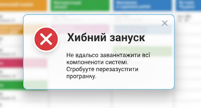
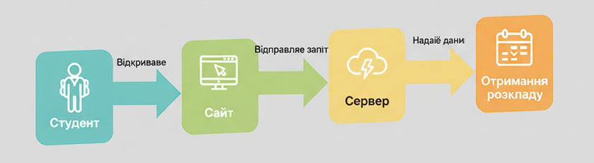

# Огляд API

Це приклад простого API для вебсайту розкладу.  
Він показує, як програма отримує розклад і як можна надіслати відгук.

## GET /schedule/{group}
Отримати розклад для конкретної групи.

**Приклад запиту**  : GET /schedule/371

**Приклад відповіді**: Група: 371
День: П'ятниця
13:15 - Архітектура ком'ютерів
14:45 - Основи програмної інженерії
16:15 - Основи програмної інженерії/Теорія ймовірностей та математична статистика

**Коди помилок:**
- 200 — успішно
- 404 — групу не знайдено

## POST /feedback
Надіслати відгук про сайт.

**Приклад запиту** : Ім'я: Іван
Повідомлення: Сайт зручний

**Приклад відповіді** : Відгук успішно надіслано. Дякуємо!

**Коди помилок:**
- 200 — успішно
- 404 — не заповнені обов’язкові поля

## GET /teachers
Отримати список викладачів, які ведуть заняття у групі.

**Приклад запиту:** GET /teachers/371

**Приклад відповіді**  : Група: 371  
Викладачі:  
- Стефієнко В. М. (Архітектура ком'ютерів)  
- Мертвиченко В.А (Основи програмної інженерії)  
- Руденко І.Б. (Теорія ймовірностей та математична статистика)

**Коди помилок:**
- 200 — успішно
- 404 — групу не знайдено

**Повідомлення помилки**

**Приклад діагрми**
