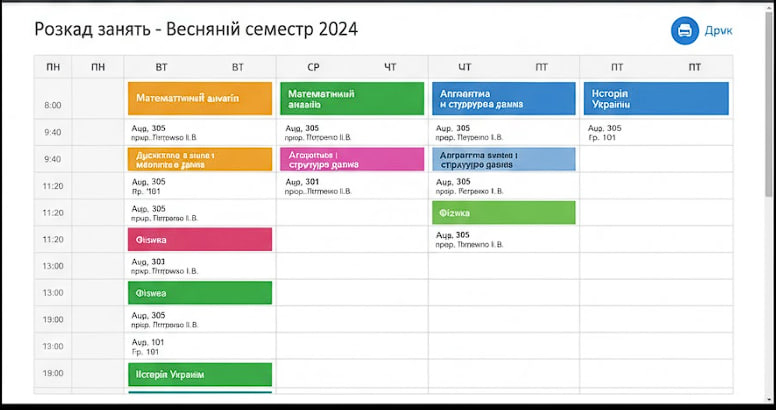
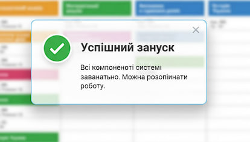

# Інструкція зі встановлення та запуску

## Що потрібно

- Будь-який браузер
- Підключення до Інтернету

## Кроки запуску

1. Відкрийте сайт у браузері.
2. Якщо сайт локальний, відкрийте файл `index.html`.
3. Оберіть свою групу та перегляньте розклад.

## Перевірка роботи

- Якщо відображається таблиця з днями та заняттями, все працює правильно.
- Якщо нічого не видно — перевірте інтернет-з’єднання або відкрийте сторінку заново.

