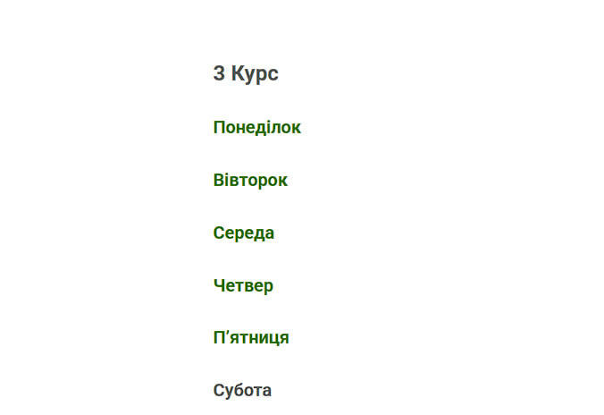
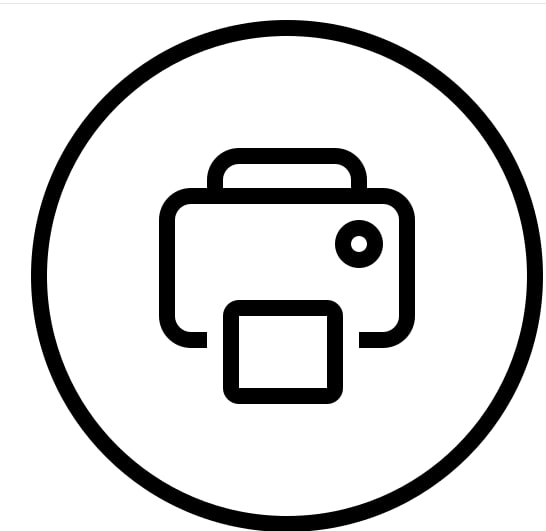

# Початок роботи

1. Відкрийте сайт у браузері.
2. Оберіть свою групу зі списку.
3. Перегляньте розклад на потрібний день або тиждень.

# Приклади інтерфейсу

- Домашня сторінка: список груп і кнопка “Переглянути розклад”
- Сторінка розкладу: таблиця з днями тижня та аудиторіями

# FAQ

**Q: Як знайти розклад для своєї групи?**  
A: Виберіть групу зі списку на головній сторінці.

**Q: Чи можна роздрукувати розклад?**  
A: Так, натисніть кнопку “Друк”.

**Q: Чи можна змінити вид відображення таблиці?**  
A: Так, є кнопки “День” та “Тиждень” для перемикання.

**Q: Чи потрібно створювати акаунт для перегляду розкладу?**  
A: Ні, перегляд розкладу доступний без реєстрації.

**Q: Що робити, якщо розклад не відображається?**  
A: Перевірте інтернет-з’єднання/перезавантажте сторінку.

## Приклади інтерфейсу

- Домашня сторінка:

- Сторінка розкладу:

  

- Кнопка "Друк":

  

